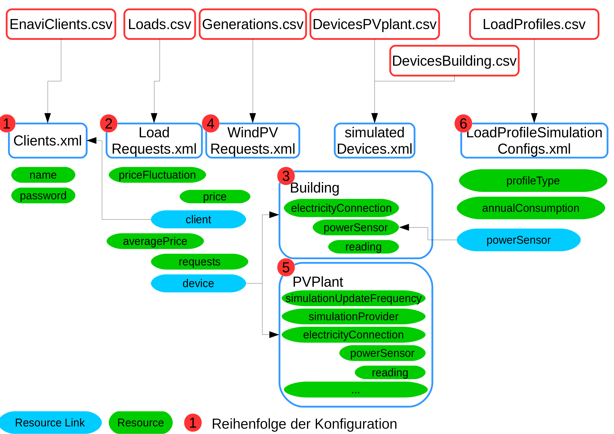

# Steps to configure

* Creation of Config CSV tables
  + Clients
  + Loads
  + Buildings
  + Generations
  + PVplants
  + LoadProfiles
* Creation of Param_Configs-table
  + definition of config ID
  + links to CSV files

# Configuring EMG

