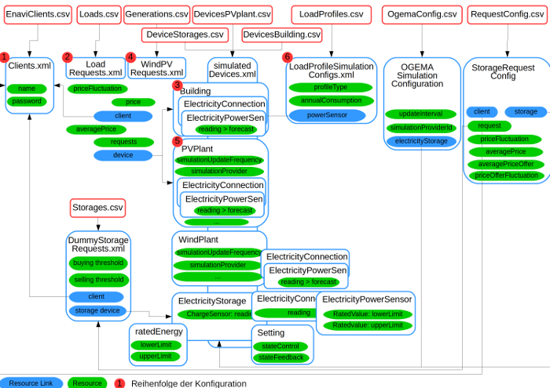

# Steps to configure

* Creation of EMG Config CSV tables
  + Clients
  + Loads
  + Buildings
  + Generations
  + PVplants
  + LoadProfiles
* Creation of Param_Configs-table
  + definition of config ID
  + links to CSV files
* Configuration of dexR
  + Adjust dexpa settings

# Configuring EMG



EMG configuration relies on a CSV configuration table which contains links to CSV tables used to derive the XML configuration for the EMGs. The package contains template files which are copied to `dexpa$dirs$config` (default: `./config`) when running

```{r, eval=FALSE}
dexR::setup_environment(dexpa)
```
This routine also copies `DEX_Runs.csv` which is used to store run information.

# Configuration of dexR


